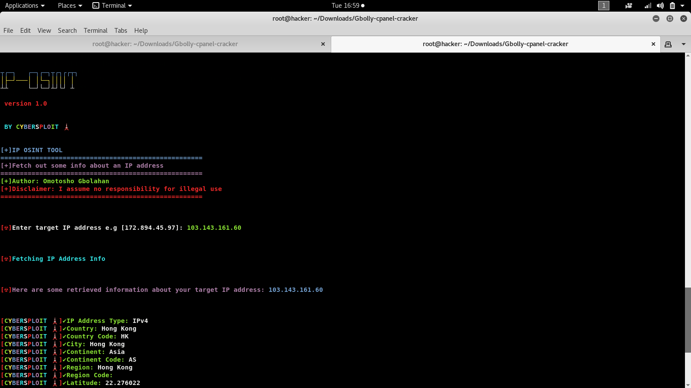
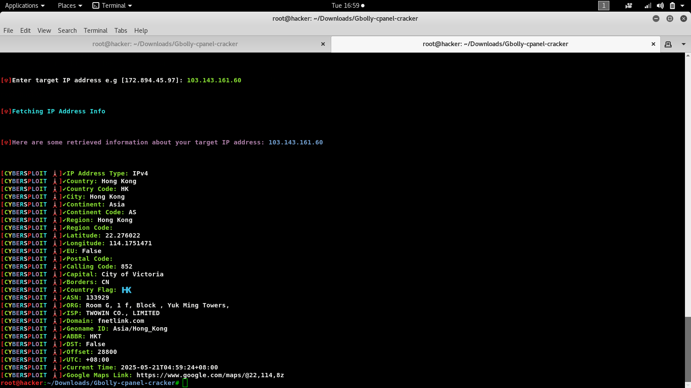
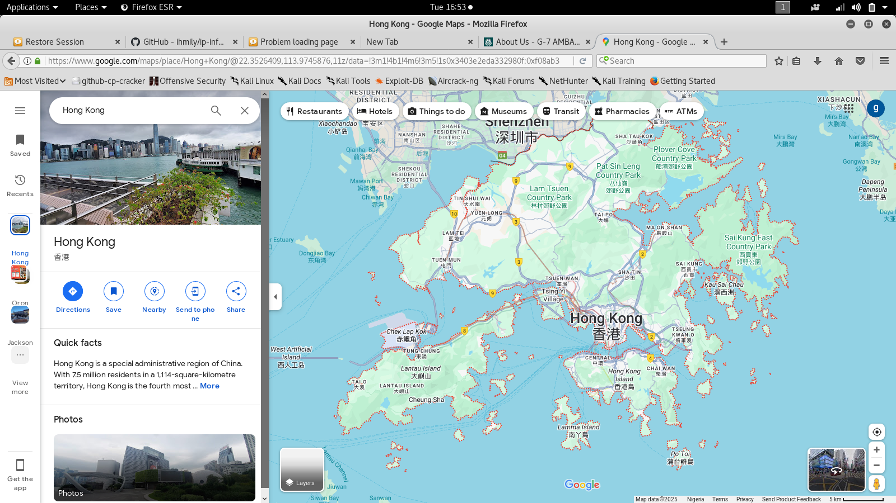
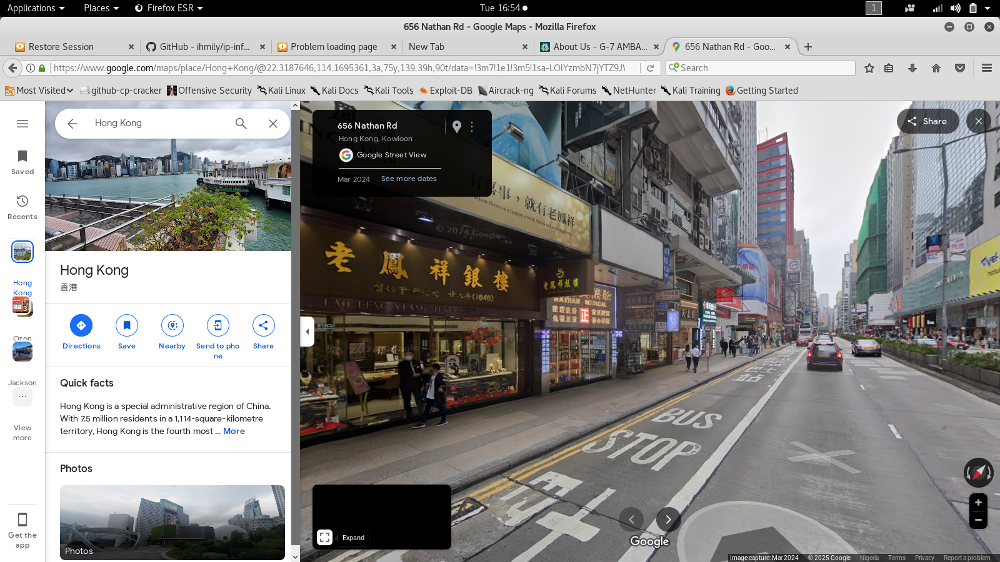

<h1 align="center">IP-Osint</h1>
  

 IP-Osint is a simple python script that fetch out some information about an ip address 
 
 Which includes geographical location 📍 like Continent, Country, Region, City, Latitude, Longitude, Capital, Borders, Internet Service Provider (ISP) 
 
 ASN (Autonomous System Number), Country code, Region code, Postal code, Calling code, Timezone, Country flag, Google Maps 🌍 Link and so on

 It supports both IPv4 and IPv6 IP Address type...................

## ScreenShots
 

**Requirements**

- Python 3.x.x
- Required Python packages: 

---------------------------------
* re
* json
* requests
---------------------------------

## Command

  git clone https://github.com/Gbolahanomotosho/IP-Osint

  cd IP-Osint
 
  pip3 install -r requirements.txt
 
  python3 IP-Osint.py

## Disclaimer: 

  For educational purpose only......
  
  

  I wont be responsible for any malicious use of this tool.......

